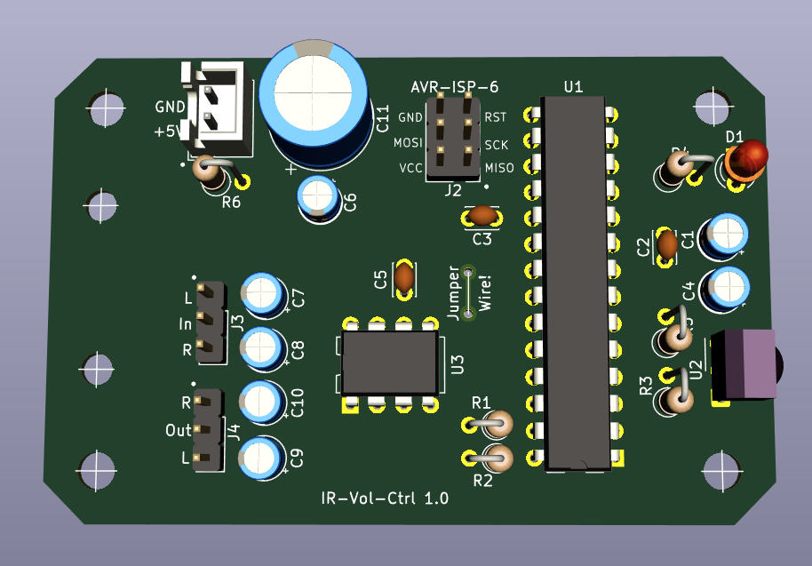

# Volume Remote Control

This project contains a hard- and software solution to control the volume, balance and muting of a stereo line signal.

## Motivation
I was not able to control the volume of my home cinema setup remotely, because I use a Logitech Z4 which has only a wired volume remote:
```
         Fire TV Stick
              ▼
HDMI to HDMI and Audio Converter
    ┌─────────┴────────────┐
    ▼                      ▼
Video Projector       2.1 Speaker System
                        (Logitech Z4)
```
## Hardware


The main components are a microcontroller ([ATmega328P](https://www.microchip.com/wwwproducts/en/ATmega328P)) and a electronic volume controller IC ([PT2257](https://dtsheet.com/doc/592434/ptc-pt2257-s)). You can find the KiCad files (schema and PCB) in the [hardware directory](./hardware/). I used a single layer PCB which I made via [direct toner transfer method](https://www.electronicshub.org/how-to-make-pcb-at-home/). The shape of the PCB fits exactly into a [TerraTec CINERGY T2 case](https://commons.wikimedia.org/wiki/File:TerraTec_Cinergy_T%C2%B2-92062.jpg). The Volume Remote Control is connected between the audio output of the HDMI Converter and audio input of the 2.1 Speaker System.

## Software
I used [Visual Studio Code](https://code.visualstudio.com/download) and the [PlatformIO extension](https://platformio.org/install/ide?install=vscode). You can find the PlatformIO project files in the [software directory](./software/). Thanks to ["IRMP - Infrared Multi Protocol Decoder + Encoder"](https://github.com/ukw100/IRMP) library it provides support for thousands of IR Remotes (I use a [Apple Remote 2nd Gen.](https://en.wikipedia.org/wiki/Apple_Remote)).

## Flashing the Firmware
I used an Arduino UNO to flash the ATmega328P via the ISP connector on the PCB. For more details see [ArduinoISP](https://www.arduino.cc/en/pmwiki.php?n=Tutorial/ArduinoISP)


## Handling

### "Learn a new remote" mode
The start of this mode is indicated by alternate green and red flashing LED until the first button is learned.

When the Controller is powered on without having learned successfully a remote before, it starts automatically in this mode. You can also enter this mode after a remote was already learned by power of and on the controller and press a button on the remote within the first 5 seconds (green LED is on).
Important: To prevent unintended re-learning (e.g. your remote stuck in the couch and a button is pressed permanently) a pressed button is ignored if this button and the first button to learn (Volume up) is the same!

It expects the learning of remote buttons in this order:

1. Volume up
1. Volume down
1. Mute on/off
1. Balance left
1. Balance right
1. Preset

Each successful learned button is confirmed by flashing the green LED for 1 second. If an invalid IR command was received (e.g. from a second remote which has a different address) the learning mode will be interrupted.
In case you don't want define all buttons (e.g. your remote has less buttons) you can press a button which was already assigned. In this case the function will be not supported.

If the last button is learned, the green LED flashes 3 times and the new learned buttons are stored into the non volatile memory of the µC. 

### Volume
Press the learned "Volume up" or "Volume down" button to increase or decrease the volume.

### Balance
Press the learned "Balance left" or "Balance right" button to shift the balance to the left or right.

### Mute
Press the learned "Mute" button to toggle mute on and off.

### Preset
To restore the presets for volume and balance press and release the learned "Preset" button.
To store the current volume and balance as presets press and hold the learned "Preset" button for 3 seconds.
